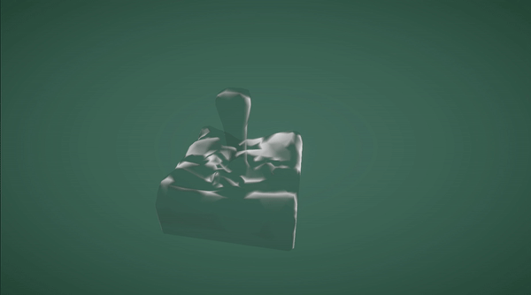

# Blender VAT (Vertex Animation Texture)

## requirement
- Blender
- Python3
    - imageio (with freeimage plugin)
    - numpy
- Unity [URP]

## Usage
- Resource Generation
    1. Install python3 and python requirements wrote in `requirements.txt`
    2. Modify `build_vat.py` set data_path to your obj models path.
    3. Create `output` folder in the same directory with `build_vat.py`
    4. Export blender animation sequences in wavefront obj format into `output` folder. (DO NOT EXPORT MATERIALS).
    5. Run `./build_vat.py`
    6. Copy `unity/create_vat_mesh.cs` to unity `Assets/Editor` folder (create it if you don't have it)
- Unity Asset
    1. Select `vat_vertex_tex.exr` and Click Unity Menu `VAT/Create VAT Mesh` create vat mesh for current vat textures.
    2. Create Unity Material with `shader/VATFluid.shader`, attach vat textures to spercific material slot. 
    3. Create any unity 3D GameObject and replace mesh with generated vat mesh.
    4. Set material to generated material.
    5. Done

and generated vat textures to render VAT mesh in unity.

## Realtime Rendering Result in Unity

### Caution
Because vat texture is data texture. So vat texture import setting must set in specific form.
- [IMPORTANT] Compression `None`.
- sRGB set to `false`.
- FilterMode set to `Point Filter`.
- Generate Mip Maps set to `false`.
- Max Size set to the same size as vat textures.
- Alpha Source set to `None`
